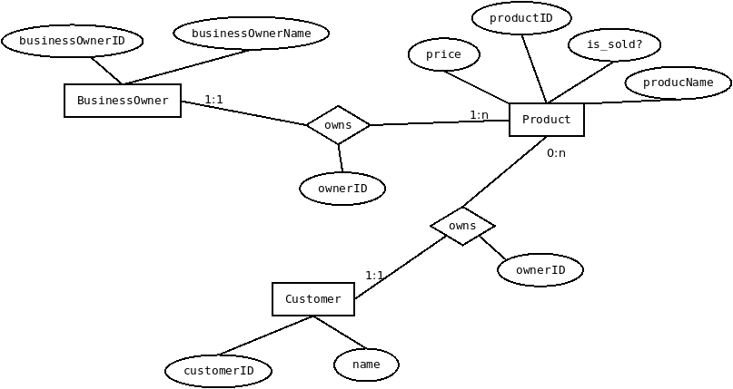

# Introduction
We want to design a webservice that connects local business and people who want
to buy from that local business. The service is free and open-source and only
controlled via the open-source community. The local businesses will not be
charged to use the service. 

Business here means Restaurants, Grocery Stores, Butchers or (any other small
business). What exactly it is not necessary for the current scope of things.
What type of product will we list in the website will not also be necessary for
the current scope of things.

# Motivation
1. Help small business make money (in the face of current crisis).
2. Due to overcentralization of marketplace, we want to decentralize the
   marketplace. We want small business owners to have their place in the
   internet. And reduce our dependence on big corporations.

# Objectives
### Immediate Objectives
Make a minimum viable product that allows businesses to list the products and
customers to buy the products.

### Future Objectives
1. See how it can be decentralized (check how the business owner can set up the
   virtual shop by themselves). But this falls outside the project of DBWS and
   falls inside the Computer Networks.
2. Payment methods incorporation. Proprietary payment methods like Paypal
   cannot be incorporated without fees to said agencies. We would want an accessible
   open solution like cyptocurrency.
3. Arrangement of delivery services. (This falls outside the scope of this project)
4. Arrangement of refund services.

# User Story
### User Story from buyer's side (Meaning what the customer sees)
1. User can see a list of businesses in the homepage.
2. Inside the list of business, buyer see Products descriptions (prices, product name, etc.)
3. Buyers can buy the selected item from the business.
4. The item get deleted from the business and gets added to the history (of
   purchases made by the buyer).
5. His/her account funds maybe get depleted. (optional feature, we can add this later)

##### Actions that are not allowed by the buyer
1. Buyers cannot create a shop (or upload products to sell). Buyers can only by products.

### User Story from business owner's side (Meaning what the business sees or can do)
1. Create a shop (virtual shop) in the website. Only one shop is only allowed by one business owner.
2. Upload or Add his/her product in the website.
3. Make or Increase his/her funds when the customer decides to buy the product. (we can add this later)

##### Actions that are not allowed by the business owner
1. Cannot buy products from other/own's product.
2. Businesses cannot own the product that they already sold.

# Work structure
### Main things that will take time
1. Database designing.
2. Backend designing. (This means that there might be some agent in the backend
   that is running that acts like a glue between frontend and database). The
   backend will also be used for authentication purposes.
3. Designing the frontend. (This will not take so much time if frameworks will
   be allowed. This needs to be confirmed with TA/Professor)

### Languages to be used
1. JS
2. MySQL Database
3. PHP. (Check if this can be substituted with python or with frameworks, only if allowed)

### Frameworks (This needs to be checked with TA/Professor if this is allowed or not)
1. ReactJS
2. VueJS

# ER Model
### Entites and Attributes
1. BusinessOwner (businessOwnerID, businessOwnerName)
2. Customer (customerID, customerName)
3. Products (price, productID, is_sold?, productName)
4. Shops (maybe we use it in the future whenever it is needed)

### Relationship and its Attributes
1. owns (ownerID)

